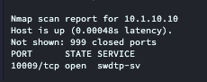
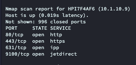
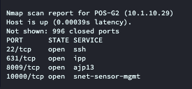
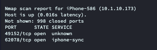
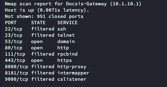
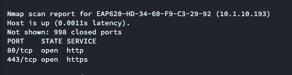
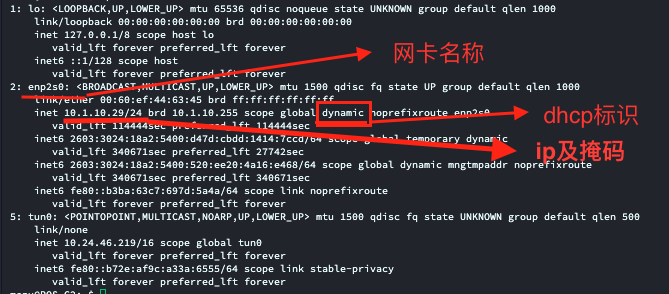

# One_Dragon_Go - Ubuntu POS 运维一体化脚本

> ubuntu 系统软件使用的运维脚本 集成多版本的升级包和部分常用补丁（持续更新）

---

## ✨ 功能总览

| 主菜单项 | 子功能 | 说明 |
|---------|--------|------|
| **1. 升级** | 1.1 ~ 1.5 | 自动下载并执行对应 POS 版本升级脚本 |
| **2. 打补丁** | 2.1 / 2.2 | 安装 16.6 fast18 补丁 / 执行 SQL （166-167） 修复 |
| **3. 网络设置** | 3.1 ~ 3.4 | 静态 IP 追加、DHCP 重置、刷卡机/打印机扫描对比 |

---

### 安装与运行
- 执行以下命令

    cd ~ && rm -f /home/menu/One_Dragon_Go.sh&& wget https://github.com/jonaszhang91/update/raw/refs/heads/main/One_Dragon_Go.sh&& sudo bash /home/menu/One_Dragon_Go.sh

---

### 备份工具和网盘地址

    wget -O rclone.conf https://github.com/jonaszhang91/update/raw/refs/heads/main/backup/rclone.conf  && wget -O backup_restore.sh https://raw.githubusercontent.com/jonaszhang91/update/main/backup/backup.sh && chmod +x backup_restore.sh &&sudo ./backup_restore.sh

- 网盘地址

    https://drive.google.com/drive/u/0/folders/19YwgZvRA-RzhSbjvGCLBFEhLK8T2vPaY

---
### 菜单

#### 一级菜单

1. 升级 (Fast0直接跑升级包)
2. 打补丁 
3. 网络设置
4. 重启tomcat
0. 退出

#### 二级菜单

- 1.1 升级 16.6 fast0
- 1.2 升级 16.7.1 fast0
- 1.3 升级 16.7.2 fast0
- 1.4 升级 30.13 （J1900 最高版本）
- 1.5 升级 30.14.9 （旧ui 最高版本）
- 2.1 16.6 fast18 补丁
- 2.2 166升级167_27more修复 
- 3.1 添加静态IP（追加模式）
- 3.2 重置网络（清除手动网段）
- 3.3 扫描刷卡机（端口10009设备和软件设置对比）
- 3.4 扫描打印机（端口9100设备和软件设置对比）

---
### 相关命令解释

#### 扫描端口命令

- 使用nmap 命令实现 对应网段扫描 
    命令格式 nmap 【条件】【网段/或者ip】
    
         nmap -p 9100 --open 192.168.1.0/24
    
    -p 代表指定端口号

    --open 二级条件在满足指定端口好的情况下 状态是开启的 如果不写则会反馈所有开启过 指定端口的 ip

    192.168.1.0/24 为对应网段或者ip

    此命令就是对192.168.1网段进行扫描 将所有开启9100端口的 ip地址返回

    也可以指定ip扫描他的端口号 

        nmap 192.168.0.199
    
    这个命令就是针对 此ip进行定向扫描 返回此ip所有开启的端口，如果是智能设备如手机、平板会返回设备名称， 可以通过此命令定位网络冲突设备，或者检查刷卡机10009端口是否开启。

        ps：此命令可以灵活使用判断网络设备类型和状态
        label打印机、kiosk打印机端口： 9200
        刷卡机端口 ： 10009
        常规打印机端口 ： 9100
        liunx系统设备远程端口 ： 22
        http服务端口 ：80/8080
        https服务端口 ： 443
    例：
    - 刷卡机

    
    
    - 打印机

    

    - POS电脑 Linux

    

    - Iphone

    

    - 路由器

    

    - 智能设备安卓(posgo)

    

- ip a 命令 展示本机ip地址

    

- 官方文档地址
    https://nmap.org/man/zh/index.html

### Rclone命令
    Rclone 是一款管理云存储文件的命令行程序，通过储存云盘key进行直接配置来实现多设备无需登陆上传和下载云盘文件。
    
    本项目通过Rclone config 命令来设置相关网盘授权，使用google网盘授权，通过github储存授权来实现，多设备上传文件

- 官方文档
     https://rclone.cn/docs/
### Mysql
    
    不多作解释 请查看各网络教程

- 常用命令 
     
    1. 备份
        
            mysqldump -u root -p --single-transaction --quick --triggers --routines kpos > backup.sql

    2. 恢复
        
            mysql -u root -p --init-command="SET autocommit=0; SET FOREIGN_KEY_CHECKS=0; SET UNIQUE_CHECKS=0; SET sql_log_bin=0;" kpos < backup.sql

    3. 清库
        
            drop database kpos；
        
    4. 增

            insert into 表名 set(列名) value(值);

    5. 删 

            delete from 表名 where 条件;

    6. 改 
            
            update 表名 set 列名 = 新值 where 条件;

    7. 查

            selcet 展示内容（*表示显示全部内容） from 表名 where 条件；
### tar压缩
tar 是 Linux/Unix 系统中最常用的打包与压缩工具。它可以将多个文件和目录合并为一个归档文件（打包），并可结合压缩算法（如 gzip, bzip2）实现压缩

Mbox导入导出工具使用的压缩命令

    ps：如果windows老版本软件 使用adminTool 工具导出的文件是加密Sql 无法压缩和常规导入，需要先解码

- 命令

    压缩：

        tar -cvf 目标文件名.tar.gz 源文件或目录

    解压：

        tar -xzvf 压缩文件名.tar.gz